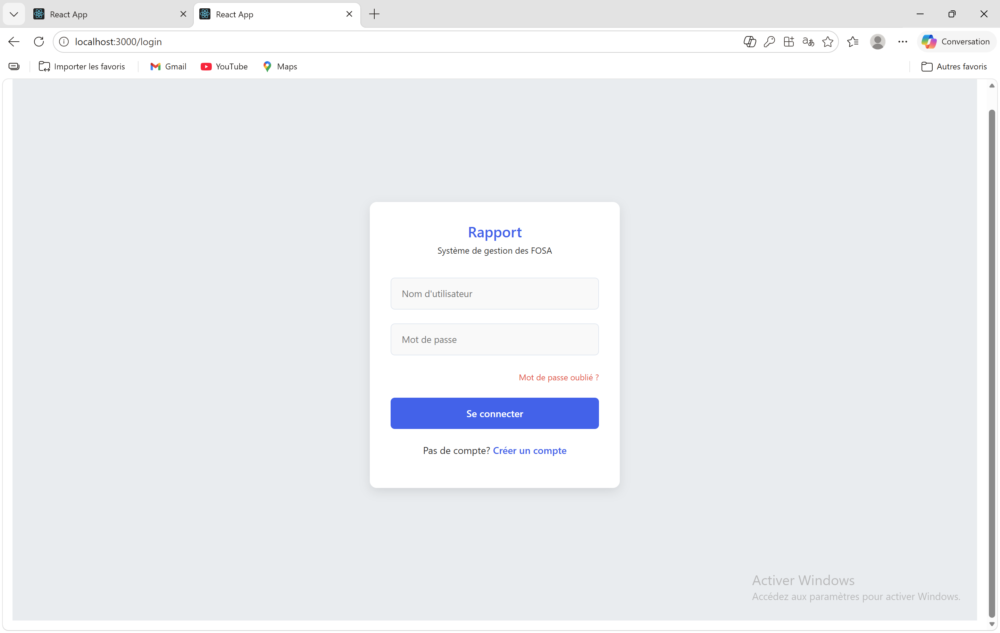
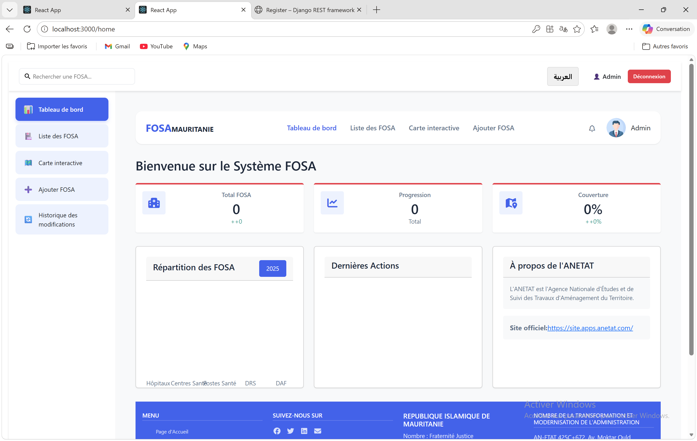
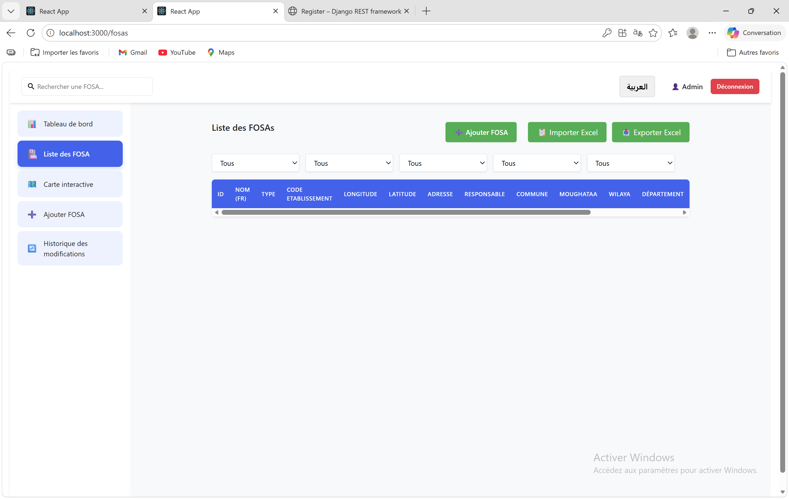
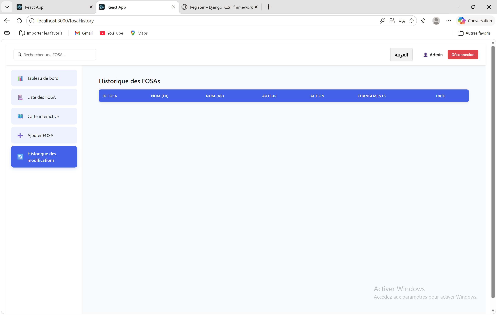
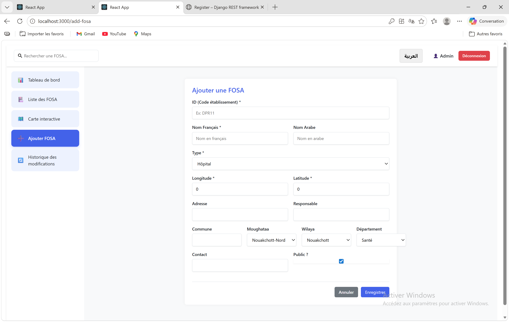
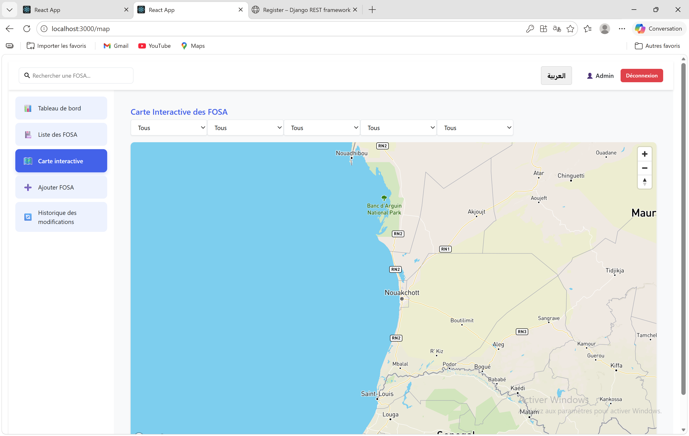

# Projet FOSA

Application web de gestion des Formations Sanitaires (FOSA) avec:
- un backend Django REST API
- un frontend React
- une visualisation cartographique
- un suivi d'historique des modifications

## Fonctionnalites principales

- Authentification JWT (connexion/inscription)
- Tableau de bord
- Liste des FOSA avec recherche
- Ajout et modification d'une FOSA
- Carte interactive des FOSA
- Historique des operations (create/update/delete)
- Import/export de donnees (Excel/CSV)

## Stack technique

- Backend: Django, Django REST Framework, SimpleJWT, django-import-export
- Frontend: React, React Router, Axios, React Leaflet, Mapbox GL
- Base de donnees: SQLite (developpement)

## Structure du projet

```text
Projet_FOSA/
  backend/        # Configuration Django
  fosa/           # App metier (modeles, vues, routes)
  frontend/       # Interface React
  screenshots/    # Captures d'ecran pour la documentation
  manage.py
```

## Prerequis

- Python 3.10+
- Node.js 18+
- npm

## Installation et execution (local)

### 1) Backend (Django)

```bash
# Depuis la racine du projet
python -m venv .venv
.venv\Scripts\activate
pip install django djangorestframework django-cors-headers django-import-export djangorestframework-simplejwt
python manage.py migrate
python manage.py runserver
```

Backend disponible sur: http://127.0.0.1:8000

### 2) Frontend (React)

```bash
# Dans un autre terminal
cd frontend
npm install
npm start
```

Frontend disponible sur: http://127.0.0.1:3000

## API principales

- `GET/POST /api/fosas/`
- `GET/PUT/PATCH/DELETE /api/fosas/{id}/`
- `POST /api/fosas/import_data/`
- `GET /api/fosas/export_data/`
- `GET /api/history/`
- `POST /api/auth/register/`
- `POST /api/auth/token/`
- `POST /api/auth/token/refresh/`

## Captures d'ecran

### Connexion



### Tableau de bord



### Liste des FOSA





### Formulaire FOSA



### Vue Carte



## Auteur

Projet realise par Mamine Lalle.
